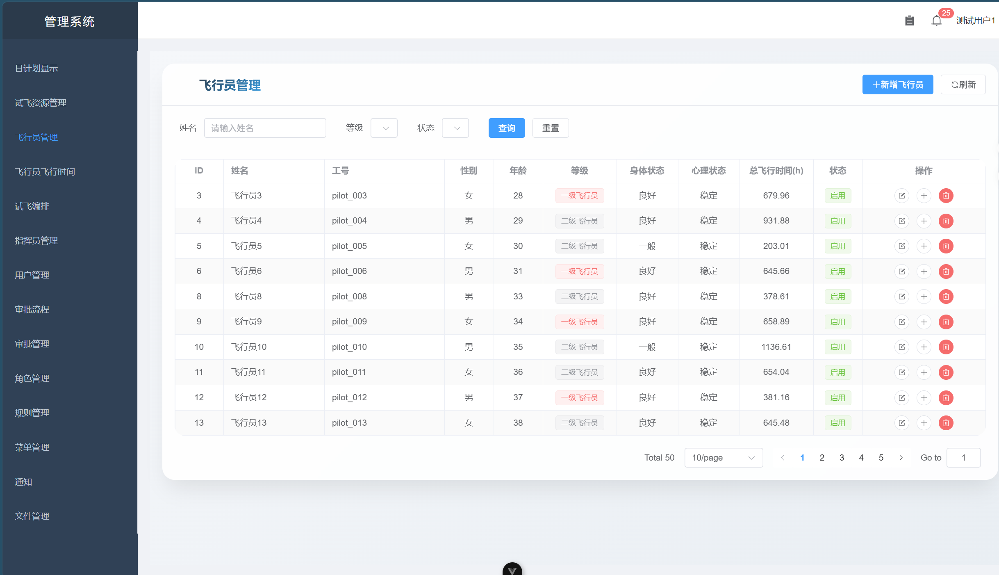
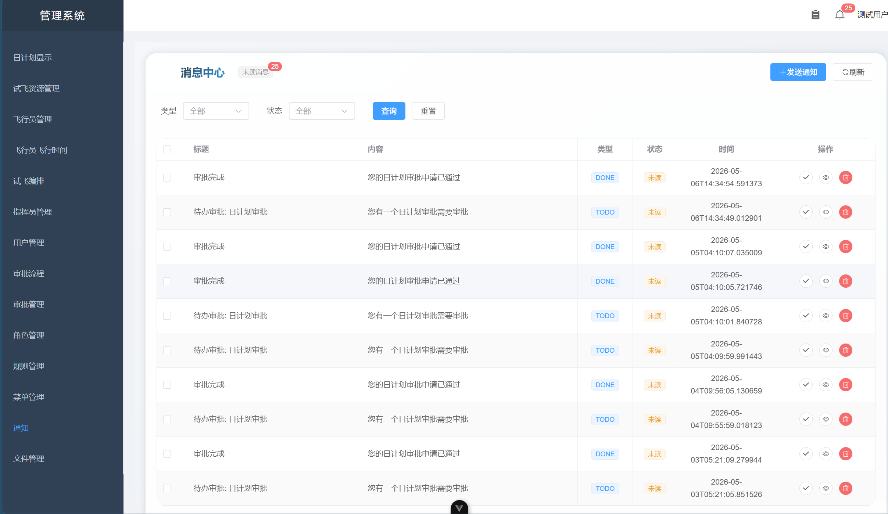
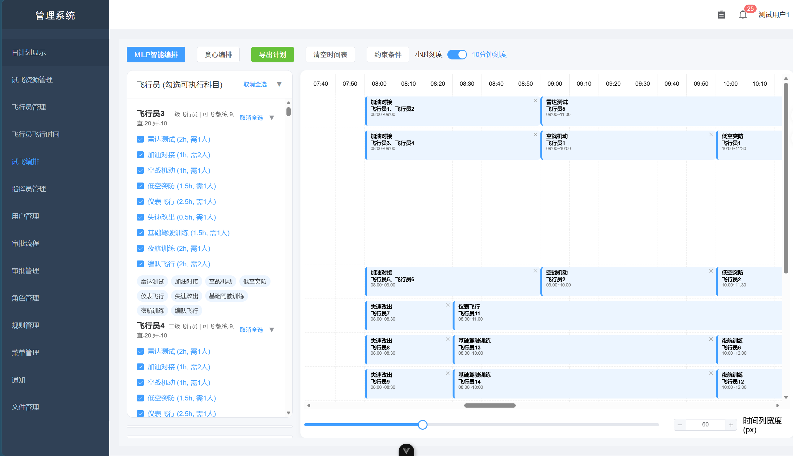
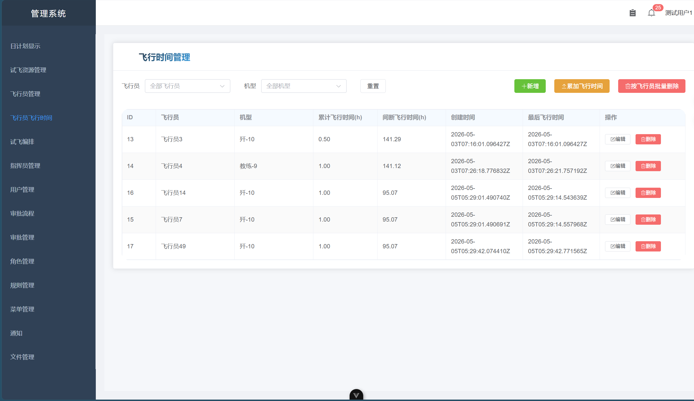

飞行计划管理系统项目介绍

**技术栈**
后端：Rust + Actix-web + SeaORM + PostgreSQL + Redis + WebSocket

前端：Vue3 + TypeScript + Vite + Pinia + Element Plus + FullCalendar

部署：Docker + Nginx + GitLab CI

**项目描述**
飞行计划管理系统是为航空单位定制的试飞任务编排平台，核心功能包括：

飞行资源管理：支持飞机、飞行员等实体的属性存储与查询。

审批工作流：支持流程定义、节点配置、会签/或签、转审、驳回重提等完整审批功能。

智能编排：基于贪心算法自动生成日计划，并支持手动拖拽调整，实时冲突检测。

**运行截图**

